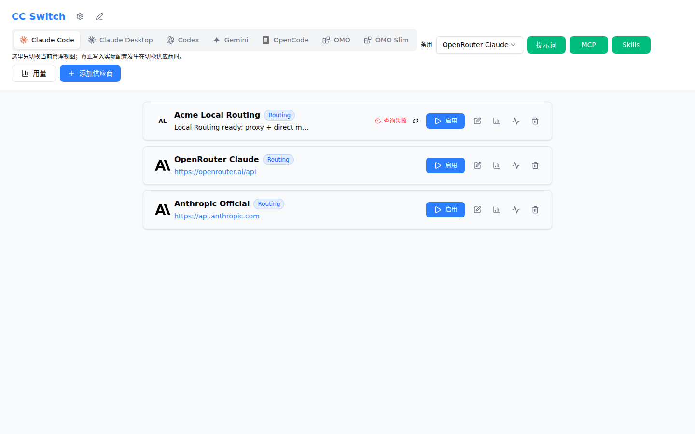
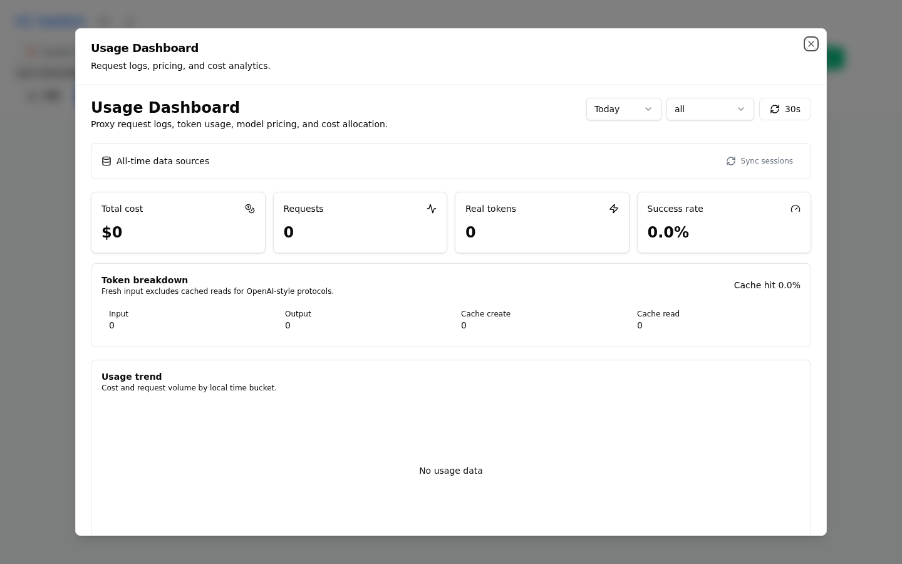
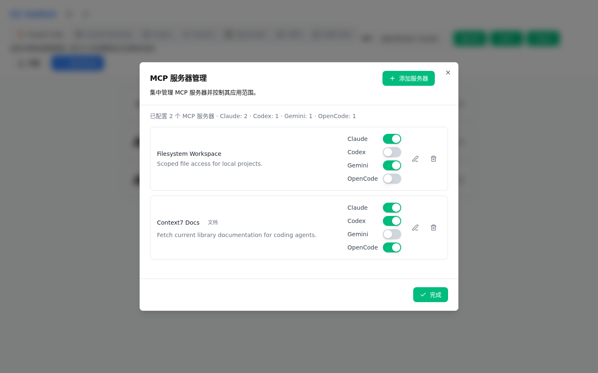
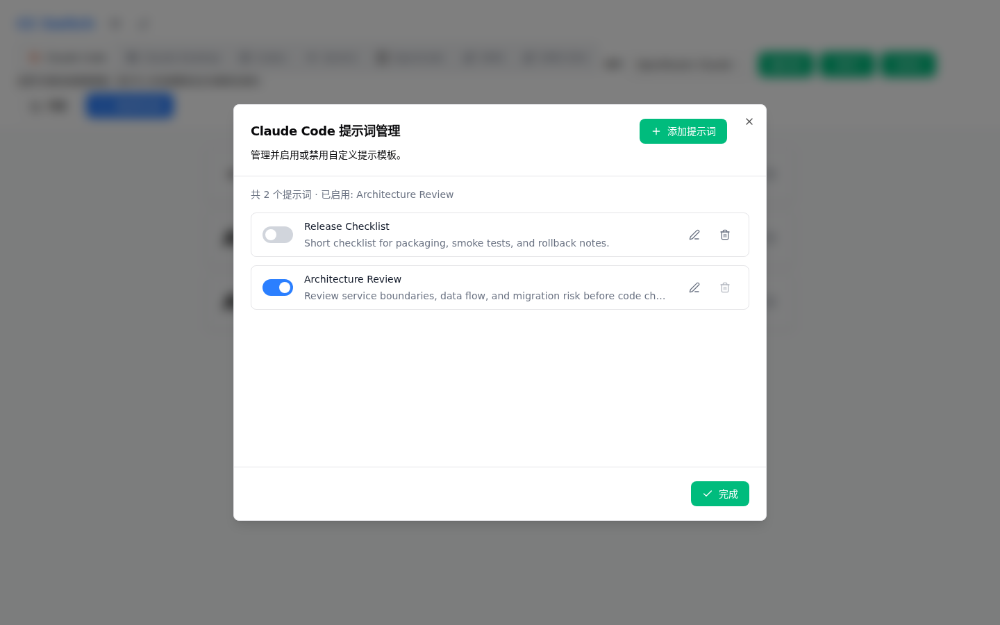
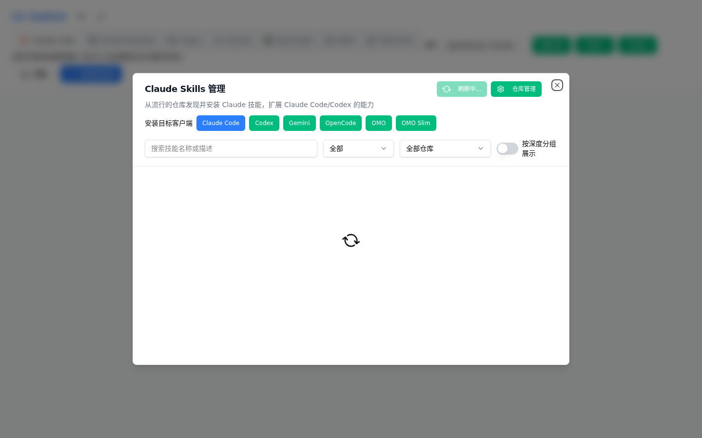
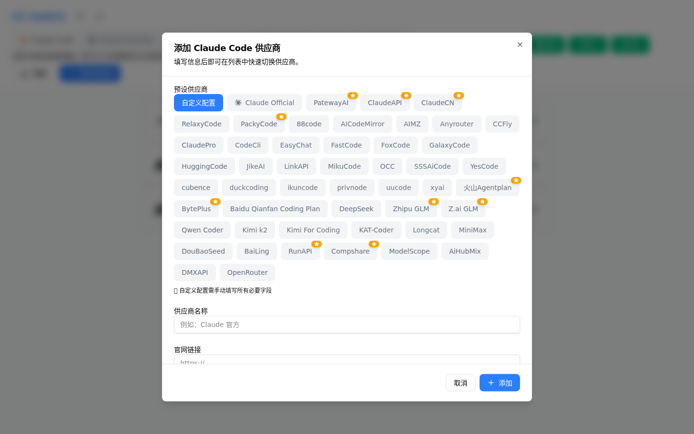
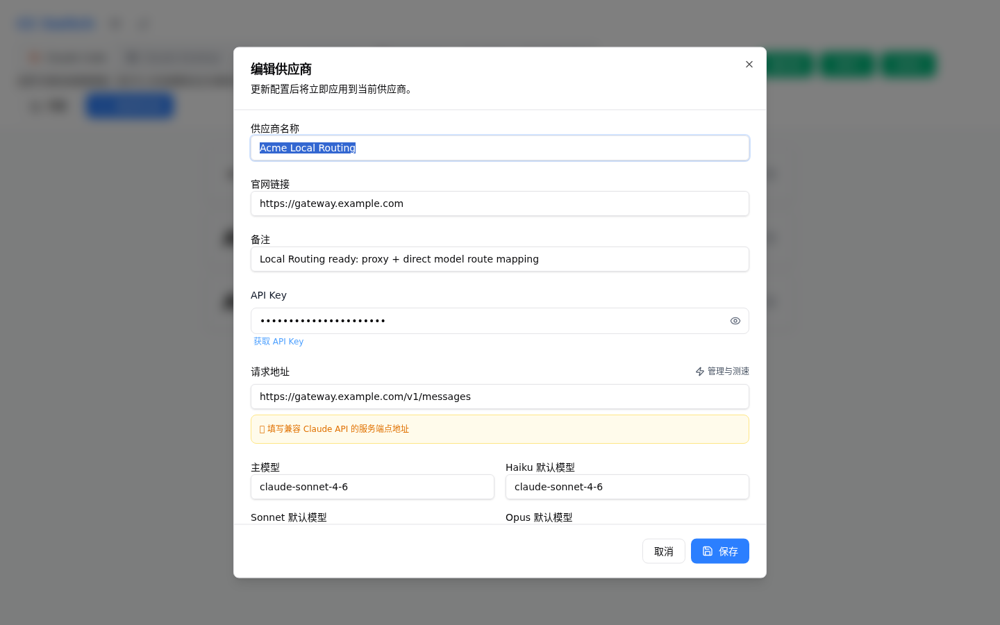

# cc-switch-web

> Web-based CC Switch for Claude Code, Codex, Gemini CLI, OpenCode, OpenClaw & OMO.

🙏 This project is a fork of [farion1231/cc-switch](https://github.com/farion1231/cc-switch) by Jason Young. Thanks to the original author for the excellent work. This fork adds Web Server mode for cloud/headless deployment.

**Cross-platform web-based All-in-One assistant for Claude Code, Codex, Gemini CLI, OpenCode, OpenClaw & OMO**

[Legal Notice](LEGAL_NOTICE.md) | [Changelog](CHANGELOG.md)

## About / 项目简介

**cc-switch-web** is a cross-platform web-based **CC Switch** for **Claude Code**, **Codex**, **Gemini CLI**, **OpenCode**, **OpenClaw**, and **oh-my-opencode (OMO)**. It lets you manage providers and host-side configuration from either a desktop app or an authenticated headless Web console.

Whether you're working locally or in a headless cloud environment, cc-switch-web offers a seamless experience for:

- **One-click provider switching** between OpenAI-compatible API endpoints
- **Unified MCP server management** across Claude/Codex/Gemini/OpenCode
- **Skills marketplace** to browse and install Claude skills from GitHub
- **System prompt editor** with syntax highlighting
- **Configuration backup/restore** with version history
- **OpenCode and OMO configuration UI** with presets, model metadata, and OMO Slim support
- **OpenClaw configuration center** for models, Agents defaults, Environment, Tools, external Provider reconciliation, Workspace, daily memory, and sessions
- **Stream health checks and retained history** for validating provider streaming responses
- **Web server mode** for cloud/headless deployment with Basic Auth

---

## Contact /联系

If you have any questions, you can contact me here https://linux.do/t/topic/1217545

## Screenshots

| Provider Switching + Local Routing | Usage Dashboard |
| --- | --- |
|  |  |

| MCP Server Management | Prompt Management |
| --- | --- |
|  |  |

| Skills Marketplace | Add Provider |
| --- | --- |
|  |  |

| Configure Provider |
| --- |
|  |

---

## Features

### Core Features

- **Multi-Provider Management**: Switch between different AI providers (OpenAI-compatible endpoints) with one click
- **Unified MCP Management**: Configure Model Context Protocol servers across Claude/Codex/Gemini/OpenCode
- **Skills Marketplace**: Browse and install Claude skills from GitHub repositories
- **Prompt Management**: Create and manage system prompts with a built-in CodeMirror editor
- **OpenCode Provider Presets**: Select AI SDK packages, import preset models, fetch model lists, and edit model variants/options
- **OMO / OMO Slim UI**: Manage oh-my-opencode and oh-my-opencode-slim configuration with structured fields
- **OpenClaw Management**: Manage additive providers, models, Agents defaults, Environment, Tools, raw JSON5, Workspace, and daily memory with ETag conflict protection and backups

### Extended Features

- **Backup Auto-failover**: Automatically switch to backup providers when primary fails
- **Stream Health Check**: Test streaming responses and classify common provider errors
- **Session Manager**: Browse host-side Claude, Codex, Gemini, OpenCode, and OpenClaw sessions with snapshot-bound pagination and protected deletion.